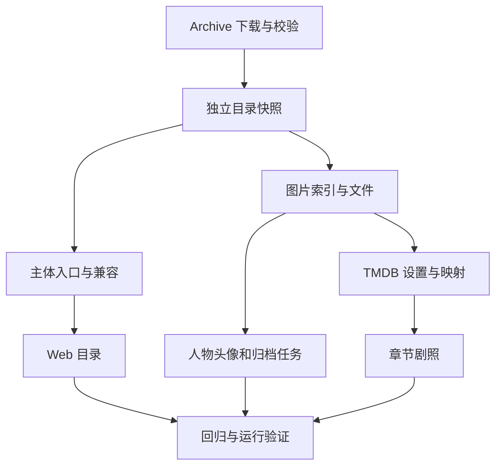

# 依赖

```mermaid
graph TD
  A[Archive 下载与校验] --> B[独立目录快照]
  B --> C[主体入口与兼容]
  C --> D[Web 目录]
  B --> E[图片索引与文件]
  E --> F[人物头像和归档任务]
  E --> G[TMDB 设置与映射]
  G --> H[章节剧照]
  D --> I[回归与运行验证]
  F --> I
  H --> I
```
